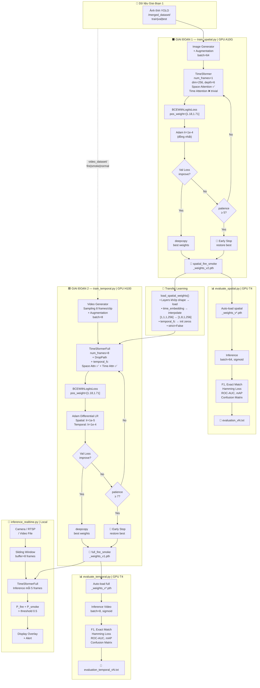

# 🔥 TimeSformer — Kiến trúc & Pipeline Phát hiện Lửa/Khói

> Tài liệu mô tả toàn bộ hệ thống phát hiện Lửa & Khói sớm dựa trên **TimeSformer** (Divided Space-Time Attention), triển khai trên **Modal Cloud**. Hệ thống gồm **2 giai đoạn** training và 1 module inference real-time.

---

## Tổng quan hệ thống — 5 File

| File | Vai trò | GPU | Input |
|---|---|---|---|
| [train_spatial.py](train_spatial.py) | Giai đoạn 1: Pre-train Spatial | A10G | Ảnh tĩnh |
| [evaluate_spatial.py](evaluate_spatial.py) | Đánh giá GĐ1 | T4 | Ảnh tĩnh |
| [train_temporal.py](train_temporal.py) | Giai đoạn 2: Full Spatio-Temporal | H100 | Video clip |
| [evaluate_temporal.py](evaluate_temporal.py) | Đánh giá GĐ2 | T4 | Video clip |
| [inference_realtime.py](inference_realtime.py) | Real-time inference | Local | Camera/RTSP |

---

## Chiến lược 2 Giai đoạn

TimeSformer có **2 loại attention** hoạt động độc lập trong mỗi Block:

| Loại Attention | Học gì | Cần dữ liệu |
|---|---|---|
| **Space Attention** | Hình dạng, màu sắc, texture của lửa/khói trong 1 frame | Ảnh tĩnh ✅ |
| **Time Attention** | Sự biến đổi, chuyển động, lan rộng qua nhiều frame | Video clip ✅ |

```
Giai đoạn 1 — Spatial Pre-training  [train_spatial.py]
━━━━━━━━━━━━━━━━━━━━━━━━━━━━━━━━━━━━━━━━━━━━━━━━━━━
  num_frames = 1  →  Time Attention gần như vô nghĩa (T=1)
  Dữ liệu   : Ảnh tĩnh YOLO format  (merged_dataset/)
  Mục tiêu  : Học nhận biết hình dạng/texture lửa & khói
  Output    : spatial_fire_smoke_weights_v2.pth
                          │
                          │  Transfer Learning (strict=False)
                          │  + Resize time_embedding T=1→T=8
                          ▼
Giai đoạn 2 — Full Spatio-Temporal  [train_temporal.py]
━━━━━━━━━━━━━━━━━━━━━━━━━━━━━━━━━━━━━━━━━━━━━━━━━━━
  num_frames = 8  →  Time Attention được kích hoạt hoàn toàn
  Dữ liệu   : Video clips  (video_dataset/{fire,smoke,normal}/)
  Mục tiêu  : Học biến đổi không-thời gian của lửa/khói
  Output    : full_fire_smoke_weights_v1.pth
```

> **Tại sao 2 giai đoạn hiệu quả hơn train end-to-end?**
> - Dữ liệu ảnh tĩnh dồi dào hơn nhiều → spatial features học tốt trước
> - Fine-tune temporal chỉ cần dataset video nhỏ hơn
> - Tránh gradient vanishing khi train từ đầu với chuỗi dài

---

## Phần 1: Kiến trúc Lõi TimeSformer

### 1.1 Sơ đồ kiến trúc tổng thể

```
Input Video:  [B, C, T, H, W]
  B=batch, C=3(RGB), T=frames, H=W=224

          │  rearrange: b c t (h p1) (w p2) → b t (h w) (c p1 p2)
          ▼
  ┌─────────────────────────────────┐
  │   Patch Embedding (Linear)      │  3×16×16=768 → dim=256
  │   (B, T, 196, 256)              │  196 = (224/16)²
  └─────────────────────────────────┘
          │  concat CLS token per frame
          ▼
  ┌─────────────────────────────────┐
  │   CLS Tokens: (B, T, 197, 256) │  1 CLS + 196 patch per frame
  └─────────────────────────────────┘
          │  + pos_embedding [1,1,197,256]   (spatial position)
          │  + time_embedding[1,T,1,256]    (temporal position, patches only)
          ▼
  ┌─────────────────────────────────────────────────────────┐
  │           DividedSpaceTimeBlock × 6                     │
  │                                                         │
  │  ┌──────────────────────────────────────────────────┐   │
  │  │ TEMPORAL ATTENTION                               │   │
  │  │  Reshape: [B,T,N,D] → [(B×N), T, D]             │   │
  │  │  → LayerNorm → Multi-Head Attn → temporal_fc     │   │
  │  │  → DropPath → Residual add                       │   │
  │  │  Reshape back: [(B×N),T,D] → [B,T,N,D]          │   │
  │  └──────────────────────────────────────────────────┘   │
  │                        │                                │
  │  ┌──────────────────────────────────────────────────┐   │
  │  │ SPATIAL ATTENTION                                │   │
  │  │  Reshape: [B,T,N,D] → [(B×T), N, D]             │   │
  │  │  → LayerNorm → Multi-Head Attn → proj            │   │
  │  │  → DropPath → Residual add                       │   │
  │  │  Reshape back: [(B×T),N,D] → [B,T,N,D]          │   │
  │  └──────────────────────────────────────────────────┘   │
  │                        │                                │
  │  ┌──────────────────────────────────────────────────┐   │
  │  │ MLP (Feed-Forward)                               │   │
  │  │  Reshape: [B,T,N,D] → [(B×T×N), D]              │   │
  │  │  → LayerNorm → Linear(256→1024) → GELU           │   │
  │  │  → Dropout → Linear(1024→256)                    │   │
  │  │  → DropPath → Residual add                       │   │
  │  │  Reshape back: [(B×T×N),D] → [B,T,N,D]          │   │
  │  └──────────────────────────────────────────────────┘   │
  └─────────────────────────────────────────────────────────┘
          │  LayerNorm toàn cục
          │  Lấy CLS token mỗi frame: x[:,: ,0,:]  → [B, T, D]
          │  Mean over time dimension                → [B, D]
          ▼
  ┌─────────────────────────────────┐
  │   MLP Head                      │
  │   LayerNorm → Linear(256→2)     │
  └─────────────────────────────────┘
          │
          ▼
  Output logits: [B, 2]  →  sigmoid  →  [P(Fire), P(Smoke)]
```

### 1.2 Khối `Mlp` — Feed-Forward Network

```python
Linear(dim, mlp_dim)  →  GELU  →  Dropout  →  Linear(mlp_dim, dim)  →  Dropout
```

- **mlp_ratio = 4** → `mlp_dim = dim × 4 = 256 × 4 = 1024`
- **Activation**: GELU (Gaussian Error Linear Unit), mượt hơn ReLU

### 1.3 Khối `Attention` — Multi-Head Self-Attention

**Tham số:**

| | Giai đoạn 1 (Spatial) | Giai đoạn 2 (Full) |
|---|---|---|
| `heads` | 8 | 8 |
| `head_dim` | 256 // 8 = 32 | 256 // 8 = 32 |
| `scale` | 32^(-0.5) ≈ 0.177 | 32^(-0.5) ≈ 0.177 |
| `qkv_bias` | `False` | **`True`** (cải tiến) |

**Luồng tính toán:**

```
x: [B, N, C]
  │
  ▼  Linear(C, 3C)  →  reshape  →  [B, N, 3, heads, head_dim]  →  permute
  │
  ▼  Q, K, V  mỗi cái shape [B, heads, N, head_dim]
  │
  ▼  Attention = softmax(Q · Kᵀ × scale)    →  [B, heads, N, N]
  │  AttnDrop
  ▼  Output = Attention · V                 →  [B, heads, N, head_dim]
  │
  ▼  transpose + reshape  →  [B, N, C]
  │  Linear(C, C)  +  ProjDrop
  ▼
```

### 1.4 Khối `DividedSpaceTimeBlock` — Đột phá chính

Đây là core của TimeSformer. Thay vì joint space-time attention O(T²N²), cơ chế này tách ra:
- **Time Attention**: O(T²) per patch — học temporal dynamics
- **Space Attention**: O(N²) per frame — học spatial patterns

**Input shape**: `[B, T, N, D]` với B=batch, T=frames, N=patches+1, D=dim

#### Bước 1 — Temporal Attention

```python
# Gom tất cả batch và patch, attend qua T frames
xt = rearrange(x, 'b t n d -> (b n) t d')  # [(B×N), T, D]

# Theo Facebook Research: dùng temporal_fc làm residual gate
res = temporal_fc(temporal_attn(temporal_norm1(xt)))
res = DropPath(res)

x = x + rearrange(res, '(b n) t d -> b t n d', b=b, n=n)
```

> **`temporal_fc` — điểm khác biệt quan trọng so với GĐ1:**
> Linear layer riêng (256→256) cho temporal output. Được **init zeros** khi transfer từ spatial model → temporal contribution = 0 ban đầu → không phá vỡ spatial features đã học.

#### Bước 2 — Spatial Attention

```python
# Gom tất cả batch và frame, attend qua N patches
xs = rearrange(x, 'b t n d -> (b t) n d')  # [(B×T), N, D]

res = attn(norm1(xs))
res = DropPath(res)

x = x + rearrange(res, '(b t) n d -> b t n d', b=b, t=t)
```

#### Bước 3 — MLP

```python
xm = rearrange(x, 'b t n d -> (b t n) d')  # [(B×T×N), D]
x = x + rearrange(DropPath(mlp(norm2(xm))), '(b t n) d -> b t n d', b=b, t=t, n=n)
```

### 1.5 Cải tiến Giai đoạn 2 so với Giai đoạn 1

| Thành phần | Giai đoạn 1 (TimeSformer) | Giai đoạn 2 (TimeSformerFull) |
|---|---|---|
| `qkv_bias` | `False` | **`True`** |
| `DropPath` | ❌ Không có | ✅ **Stochastic Depth** |
| `temporal_fc` | ❌ Không có | ✅ **Init zeros** |
| `_init_weights` | Random | **trunc_normal(std=0.02)** |
| `drop_path_rate` | — | **Tuyến tính 0→0.1** theo depth |
| `mlp_ratio` | `mlp_dim=512` (fixed) | **`mlp_ratio=4`** (512 → 1024) |

#### DropPath (Stochastic Depth)

```python
# Mỗi sample trong batch có xác suất drop_prob bị bỏ qua hoàn toàn
# Tương tự Dropout nhưng drop theo sample, không phải theo neuron
keep_prob = 1 - drop_prob
random_tensor = rand(B, 1, 1, 1, ...)  # broadcast
output = x / keep_prob * random_tensor.floor()
```

Drop path rate tăng dần theo độ sâu:
```
Layer 0: dpr = 0.000
Layer 1: dpr = 0.020
Layer 2: dpr = 0.040
Layer 3: dpr = 0.060
Layer 4: dpr = 0.080
Layer 5: dpr = 0.100
```

### 1.6 Bảng Hyperparameters

| Hyperparameter | Giai đoạn 1 | Giai đoạn 2 | Ý nghĩa |
|---|---|---|---|
| `image_size` | 224 | 224 | Kích thước frame |
| `patch_size` | 16 | 16 | Patch 16×16 pixel |
| `num_frames` | **1** ⚠️ | **8** ✅ | Số frames/clip |
| `num_patches` | 196 | 196 | (224/16)² = 14×14 |
| `num_classes` | 2 | 2 | Fire + Smoke |
| `dim` | 256 | 256 | Embedding dim |
| `depth` | 6 | 6 | Số blocks |
| `heads` | 8 | 8 | Attention heads |
| `mlp_dim` | 512 | 1024 | FFN hidden dim |
| `dropout` | 0.1 | 0.1 | Dropout rate |
| `attn_drop` | 0.0 | 0.1 | Attention dropout |
| `drop_path_rate` | — | 0.1 | Stochastic depth |

---

## Phần 2: Transfer Learning (Giai đoạn 1 → Giai đoạn 2)

### 2.1 Vấn đề khi load Spatial Weights

Khi chuyển từ `num_frames=1` sang `num_frames=8`, hầu hết layers tương thích **ngoại trừ `time_embedding`**:

| Layer | Shape GĐ1 | Shape GĐ2 | Xử lý |
|---|---|---|---|
| `to_patch_embedding.weight` | `[256, 768]` | `[256, 768]` | ✅ Load trực tiếp |
| `pos_embedding` | `[1,1,197,256]` | `[1,1,197,256]` | ✅ Load trực tiếp |
| `time_embedding` | `[1,1,1,256]` | **`[1,8,1,256]`** | ⚠️ **Cần Interpolate** |
| `layers.*.attn.*` | khớp | khớp | ✅ Load trực tiếp |
| `layers.*.temporal_fc.*` | ❌ Không tồn tại | `[256,256]` | Init zeros |
| `mlp_head.*` | khớp | khớp | ✅ Load trực tiếp |

### 2.2 Hàm `load_spatial_weights`

```python
def load_spatial_weights(model, spatial_weights_path, device, target_num_frames=8):
    spatial_sd = torch.load(spatial_weights_path, map_location=device)
    model_sd   = model.state_dict()

    for key, spatial_val in spatial_sd.items():
        if key == 'time_embedding':
            # Interpolate: [1,1,1,D] → [1,8,1,D]
            t_perm    = spatial_val.permute(0, 3, 2, 1)    # [1, D, 1, 1]
            t_resized = F.interpolate(t_perm,
                            size=(1, target_num_frames),
                            mode='bilinear',
                            align_corners=False)            # [1, D, 1, 8]
            model_sd[key] = t_resized.permute(0, 3, 2, 1)  # [1, 8, 1, D]

        elif spatial_val.shape == model_sd[key].shape:
            model_sd[key] = spatial_val   # load trực tiếp

    model.load_state_dict(model_sd, strict=False)  # bỏ qua keys không match
```

### 2.3 Tại sao `temporal_fc` init zeros là quan trọng?

Khi model được khởi tạo, `_init_weights()` set toàn bộ `temporal_fc.weight = 0` và `temporal_fc.bias = 0`:

```
Temporal residual = temporal_fc(temporal_attn(x))
                  = temporal_fc(bất kỳ vector nào)
                  ≈ 0 (vì weight = 0)
```

**Hệ quả**: Ở epoch đầu tiên, temporal contribution = 0 → model hoàn toàn giống GĐ1 (spatial only) → Không phá vỡ features đã học. Dần dần temporal_fc học được giá trị khác 0 theo gradient.

---

## Phần 3: Dữ liệu

### 3.1 Giai đoạn 1 — Ảnh tĩnh (YOLO Format)

```
/data/merged_dataset/
    train/
        images/   ← ảnh .jpg/.png
        labels/   ← file .txt YOLO format (class x y w h)
    val/
    test/
```

**Chuyển đổi YOLO → Multi-label:**

| Class ID trong .txt | Nhãn | Vector |
|---|---|---|
| `0` | Lửa (Fire) | `[1.0, 0.0]` |
| `1` | Khói (Smoke) | `[0.0, 1.0]` |
| Cả `0` và `1` | Fire + Smoke | `[1.0, 1.0]` |
| Không có | Normal | `[0.0, 0.0]` |

**Tiền xử lý + Augmentation (Train only):**

```
ảnh BGR
  → Horizontal Flip (50%)
  → Contrast adjustment alpha∈[0.8,1.2] (50%)
  → Brightness adjustment beta∈[-15,15] (50%)
  → cvtColor BGR→RGB
  → resize(224, 224)
  → / 255.0  (normalize [0,1])
  → transpose HWC→CHW  →  shape [C, H, W]
  → unsqueeze(dim=1)   →  shape [C, 1, H, W]  (T=1 nhân tạo)
```

### 3.2 Giai đoạn 2 — Video Clips

```
/data/video_dataset/
    train/
        fire/    ← video chứa lửa (.mp4, .avi, ...)
        smoke/   ← video chứa khói
        normal/  ← video bình thường
    val/
    test/
```

**Multi-label từ tên thư mục:**
- `fire/` → `[1.0, 0.0]`
- `smoke/` → `[0.0, 1.0]`
- `normal/` → `[0.0, 0.0]`

**Frame Sampling Strategy:**

```
Train (augment=True):
  → Random clip start: start ∈ [0, total_frames - num_frames]
  → Lấy 8 frames liên tiếp từ start

Val/Test (augment=False):
  → Uniform sampling: linspace(0, total_frames-1, 8)
  → Trải đều suốt video
```

**Augmentation video (áp dụng nhất quán trên toàn clip):**

```
clip [T, H, W, C]
  → Horizontal Flip (50%) — tất cả T frames flip cùng lúc
  → Contrast×alpha + Brightness+beta (50%)
  → transpose [T,H,W,C] → [C,T,H,W]
  → shape [C, T, H, W] = [3, 8, 224, 224]
```

---

## Phần 4: Quá trình Huấn luyện

### 4.1 Giai đoạn 1 — Spatial Pre-training

| Tham số | Giá trị |
|---|---|
| Script | [train_spatial.py](train_spatial.py) |
| GPU | NVIDIA A10G (24GB) |
| Optimizer | Adam, `lr=1e-4` (đồng nhất) |
| Loss | `BCEWithLogitsLoss(pos_weight=[1.18, 1.71])` |
| Epochs tối đa | 100 |
| Batch size | 64 |
| Early Stopping patience | 5 epochs |
| Output | `spatial_fire_smoke_weights_v2.pth` |

### 4.2 Giai đoạn 2 — Full Spatio-Temporal

| Tham số | Giá trị |
|---|---|
| Script | [train_temporal.py](train_temporal.py) |
| GPU | NVIDIA H100 (80GB) |
| Optimizer | Adam với **Differential LR** |
| Loss | `BCEWithLogitsLoss(pos_weight=[1.18, 1.71])` |
| Epochs tối đa | 50 (transfer learning hội tụ nhanh hơn) |
| Batch size | 8 (video tốn VRAM hơn nhiều) |
| Early Stopping patience | 7 epochs |
| Output | `full_fire_smoke_weights_v1.pth` |

### 4.3 Differential Learning Rate (GĐ2)

Spatial layers (đã pre-train) cần học ít hơn, temporal layers cần học nhiều hơn:

```python
spatial_params  = [p for n,p in model.named_parameters()
                   if 'temporal' not in n and 'time_embedding' not in n]
temporal_params = [p for n,p in model.named_parameters()
                   if 'temporal' in n or 'time_embedding' in n]

optimizer = Adam([
    {'params': spatial_params,  'lr': 1e-5},   # × 0.1 — nhẹ nhàng fine-tune
    {'params': temporal_params, 'lr': 1e-4},   # × 1.0 — học mạnh temporal
])
```

### 4.4 Class Weights — Xử lý mất cân bằng

```python
pos_weights = torch.tensor([1.18, 1.71])
#                            Fire     Smoke  ← Smoke thiểu số hơn nên weight cao hơn
loss = BCEWithLogitsLoss(pos_weight=pos_weights)
```

### 4.5 Early Stopping với Best-weight Restore

```
Mỗi epoch:
  ├── Tính avg_train_loss
  ├── Tính avg_val_loss (no_grad)
  │
  ├── Nếu val_loss < best_val_loss:
  │     ├── best_val_loss = val_loss
  │     ├── epochs_no_improve = 0
  │     └── best_model_weights = deepcopy(model.state_dict())
  │
  └── Nếu không cải thiện ≥ patience lần:
        ├── model.load_state_dict(best_model_weights)  ← khôi phục
        └── break
```

### 4.6 Auto-Versioning khi lưu

```python
# Tự động tìm version lớn nhất → tạo version tiếp theo
existing = glob('/data/full_fire_smoke_weights_v*.pth')
max_v = max(int(re.search(r'_v(\d+).pth', f).group(1)) for f in existing)
torch.save(model.state_dict(), f'/data/full_fire_smoke_weights_v{max_v+1}.pth')
```

---

## Phần 5: Đánh giá

### 5.1 Giai đoạn 1 — evaluate_spatial.py

- Load `spatial_fire_smoke_weights_v*.pth` (tự động version mới nhất)
- Input: ảnh tĩnh `.unsqueeze(2)` tạo T=1 nhân tạo
- Threshold: `sigmoid(logits) > 0.5`

### 5.2 Giai đoạn 2 — evaluate_temporal.py

- Load `full_fire_smoke_weights_v*.pth` (tự động version mới nhất)
- Input: video clips, uniform sampling 8 frames
- Threshold: `sigmoid(logits) > 0.5`

### 5.3 Bộ Metrics

#### Nhóm 1: Cơ bản (Threshold = 0.5)

| Metric | Ý nghĩa |
|---|---|
| **Precision** | Trong các dự đoán Positive, bao nhiêu % đúng |
| **Recall** | Trong các nhãn Positive thực tế, bao nhiêu % tìm được |
| **F1-Score** | Harmonic mean của Precision & Recall |
| **Exact Match Ratio** | % mẫu dự đoán đúng **hoàn toàn** cả 2 nhãn |
| **Hamming Loss** | Tỷ lệ nhãn bị dự đoán sai (càng thấp càng tốt) |

#### Nhóm 2: Chuyên sâu (Threshold-Independent)

| Metric | Ý nghĩa | Quan trọng khi |
|---|---|---|
| **ROC-AUC** | Diện tích dưới đường ROC | Đo tổng quát hóa |
| **Average Precision (mAP)** | Diện tích dưới Precision-Recall curve | Dữ liệu mất cân bằng |

Cả hai tính per-class lẫn macro-average:
```
ROC-AUC Fire | ROC-AUC Smoke | ROC-AUC Macro
AP Fire      | AP Smoke      | mAP (Macro)
```

#### Nhóm 3: Confusion Matrix per-class

```
[Fire]              [Smoke]
┌─────────┬──────┐  ┌─────────┬──────┐
│ TN      │ FP   │  │ TN      │ FP   │
├─────────┼──────┤  ├─────────┼──────┤
│ FN      │ TP   │  │ FN      │ TP   │
└─────────┴──────┘  └─────────┴──────┘
```

---

## Phần 6: Real-time Inference

### 6.1 FireSmokeDetector — Sliding Window

```python
# Frame buffer (deque tự động xóa frame cũ)
frame_buffer = deque(maxlen=8)

# Mỗi N frame mới chạy 1 lần inference (tiết kiệm tài nguyên)
inference_interval = 5
```

**Luồng xử lý:**

```
Camera Frame
    │  preprocess: BGR→RGB→resize(224)→/255→CHW
    ▼
Frame Buffer (deque, maxlen=8)
    │  mỗi 5 frames → infer
    ▼
stack: [T,C,H,W] → transpose → [C,T,H,W] → unsqueeze → [1,C,T,H,W]
    │
    ▼  model.forward() với torch.no_grad()
    │
sigmoid(logits) → probs [P_fire, P_smoke]
    │  > threshold (0.5)
    ▼
Label: normal | fire | smoke | fire+smoke
    │
    ▼  draw_overlay() — viền màu + probability bar
Display
```

**Cách chạy:**

```bash
# Từ webcam:
python inference_realtime.py --source 0 --weights full_fire_smoke_weights_v1.pth

# Từ RTSP camera:
python inference_realtime.py --source rtsp://192.168.1.100:554/stream --weights weights.pth

# Từ file video:
python inference_realtime.py --source video.mp4 --weights weights.pth --threshold 0.4
```

---

## Phần 7: Sơ đồ Pipeline Tổng thể



---

## Phần 8: Tóm tắt So sánh Hai Giai đoạn

| Đặc điểm | Giai đoạn 1 (Spatial) | Giai đoạn 2 (Full) |
|---|---|---|
| **Script** | train_spatial.py | train_temporal.py |
| **Kiến trúc** | `TimeSformer` | `TimeSformerFull` |
| **num_frames** | 1 (nhân tạo) | 8 (thực sự) |
| **Time Attention** | Trivial | Fully active |
| **DropPath** | ❌ | ✅ dpr=0→0.1 |
| **temporal_fc** | ❌ | ✅ init zeros |
| **qkv_bias** | False | True |
| **Dữ liệu** | Ảnh tĩnh YOLO | Video clip thư mục |
| **Augmentation** | Flip + Brightness | + Random clip start |
| **Batch size** | 64 | 8 |
| **LR Strategy** | Uniform 1e-4 | Differential 1e-5/1e-4 |
| **Epochs** | 100 (patience=5) | 50 (patience=7) |
| **GPU** | A10G 24GB | H100 80GB |
| **Output** | spatial_v*.pth | full_v*.pth |
| **Học được** | Texture/hình dạng | + Biến đổi thời gian |
